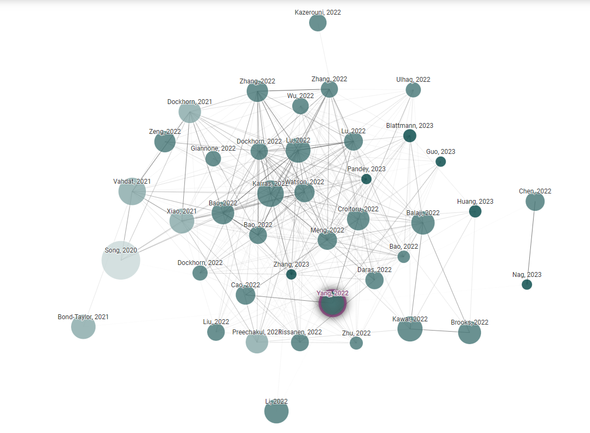

# Awesome-Diffusion-Learning

## 关于本库

扩散学习（Diffusion Learning）在近几年呈现出强大的潜力和应用前景，尤其在图像生成类的任务上表现出惊人的效果。

本库基于扩散学习这一主题，整理了一些关于扩散学习的代码和论文集，方便研究者直接查阅和快速检索。

## 综述与参考资料

本库的整理主要参考如下三篇最新的综述以及通过科研工具 [Connected Papers](https://www.connectedpapers.com/) 查询到的结果：

| 论文名称                                                             | 关键词                     | 发表时间 | 发表刊物 | 论文链接                                 | 代码链接 |
| -------------------------------------------------------------------- | -------------------------- | -------- | -------- | ---------------------------------------- | -------- |
|                             Diffusion Models in Vision: A Survey                                         |          Diffusion Models                  |   2022.9.10       |   arXiv       |          [论文链接](https://arxiv.org/abs/2209.04747)                                |    无      |
| Diffusion Models: A Comprehensive Survey of Methods and Applications | Diffusion Models           | 2022.9.2 | arXiv    | [论文链接](https://arxiv.org/abs/2209.00796) | 无       |
| A Survey on Generative Diffusion Model                               | Generative Diffusion Model | 2022.9.6 | arXiv    | [论文链接](https://arxiv.org/abs/2209.02646) | 无       |

## 相关论文

论文和代码链接均主要参考自 paper with code 网站，这是一个开源学术交流网站，它将论文、代码和数据集合并到一起，很方便研究者查阅。

### 条件生成模型

按照时间从新到旧排序。

| 发表时间            | 论文标题                                                                                | 论文、代码与数据集链接                                                                                   |
| ------------------- | --------------------------------------------------------------------------------------- | -------------------------------------------------------------------------------------------------------- |
| 2023 年 5 月 19 日  | Late-Constraint Diffusion Guidance for Controllable Image Synthesis            | [论文、代码与数据集链接](https://paperswithcode.com/paper/late-constraint-diffusion-guidance-for)        |
| 2023 年 5 月 3 日   | Shap-E: Generating Conditional 3D Implicit Functions                                    | [论文、代码与数据集链接](https://paperswithcode.com/paper/shap-e-generating-conditional-3d-implicit)     |
| 2023 年 2 月 21 日  | Diffusion Models and Semi-Supervised Learners Benefit Mutually with Few Labels          | [论文、代码与数据集链接](https://paperswithcode.com/paper/diffusion-models-and-semi-supervised-learners) |
| 2022 年 9 月 28 日  | Refining Generative Process with Discriminator Guidance in Score-based Diffusion Models | [论文、代码与数据集链接](https://paperswithcode.com/paper/refining-generative-process-with)              |
| 2022 年 8 月 29 日  | Frido: Feature Pyramid Diffusion for Complex Scene Image Synthesis                      | [论文、代码与数据集链接](https://paperswithcode.com/paper/frido-feature-pyramid-diffusion-for-complex)   |
| 2022 年 6 月 23 日  | Entropy-driven Sampling and Training Scheme for Conditional Diffusion Generation        | [论文、代码与数据集链接](https://paperswithcode.com/paper/entropy-driven-sampling-and-training-scheme)   |
| 2021 年 11 月 26 日 | Conditional Image Generation with Score-Based Diffusion Models                          | [论文、代码和数据集链接](https://paperswithcode.com/paper/conditional-image-generation-with-score-based)         |
| 2021 年 6 月 12 日  | D2C: Diffusion-Denoising Models for Few-shot Conditional Generation                     | [论文、代码和数据集链接](https://paperswithcode.com/paper/d2c-diffusion-denoising-models-for-few-shot) |

### Diffusion 模型应用类

| 发表时间            | 论文标题                                                                                                     | 论文、代码和数据集链接                                                        |
| ------------------- | ------------------------------------------------------------------------------------------------------------ | ----------------------------------------------------------------------------- |
| 2023 年 CVPR        | MM-Diffusion: Learning Multi-Modal Diffusion Models for Joint Audio and Video Generation                     | [论文、代码与数据集链接](https://paperswithcode.com/paper/mm-diffusion-learning-multi-modal-diffusion)  |
| 2023 年 CVPR        | VideoFusion: Decomposed Diffusion Models for High-Quality Video Generation                                   | [论文、代码与数据集链接](https://paperswithcode.com/paper/decomposed-diffusion-models-for-high-quality) |
| 2023 年 CVPR        | DreamBooth: Fine Tuning Text-to-Image Diffusion Models for Subject-Driven Generation                         | [论文、代码与数据集链接](https://paperswithcode.com/paper/dreambooth-fine-tuning-text-to-image)         |
| 2023 年 CVPR        | ERNIE-ViLG 2.0: Improving Text-to-Image Diffusion Model with Knowledge-Enhanced Mixture-of-Denoising-Experts | [论文、代码与数据集链接](https://paperswithcode.com/paper/ernie-vilg-2-0-improving-text-to-image)       |
| 2023 年 5 月 31 日  | Control4D: Dynamic Portrait Editing by Learning 4D GAN from 2D Diffusion-based Editor                        | [论文、代码与数据集链接](https://paperswithcode.com/paper/control4d-dynamic-portrait-editing-by)        |
| 2023 年 5 月 22 日  | VDT: An Empirical Study on Video Diffusion with Transformers                                                 | [论文、代码与数据集链接](https://paperswithcode.com/paper/vdt-an-empirical-study-on-video-diffusion)    |
| 2023 年 3 月 23 日  | Text2Video-Zero: Text-to-Image Diffusion Models are Zero-Shot Video Generators                               | [论文、代码与数据集链接](https://paperswithcode.com/paper/text2video-zero-text-to-image-diffusion)      |
| 2023 年 3 月 12 日  | One Transformer Fits All Distributions in Multi-Modal Diffusion at Scale                                     | [论文、代码与数据集链接](https://paperswithcode.com/paper/one-transformer-fits-all-distributions-in)    |
|2022 年 CVPR|Vector Quantized Diffusion Model for Text-to-Image Synthesis|[论文、代码与数据集链接](https://paperswithcode.com/paper/vector-quantized-diffusion-model-for-text-to)|
| 2022 年 12 月 22 日 | Tune-A-Video: One-Shot Tuning of Image Diffusion Models for Text-to-Video Generation                         | [论文、代码与数据集链接](https://paperswithcode.com/paper/tune-a-video-one-shot-tuning-of-image)        |
| 2022 年 9 月 22 日  | DreamFusion: Text-to-3D using 2D Diffusion                                                                   | [论文、代码与数据集链接](https://paperswithcode.com/paper/dreamfusion-text-to-3d-using-2d-diffusion)    |
| 2022 年 6 月 15 日  | Diffusion Models for Video Prediction and Infilling                                                          |   [论文、代码与数据集链接](https://paperswithcode.com/paper/diffusion-models-for-video-prediction-and)                                                                            |
| 2022 年 4 月 7 日   | Video Diffusion Models                                                                                       | [论文、代码与数据集链接](https://paperswithcode.com/paper/video-diffusion-models)                       |

### 其它（理论与优化类）

| 发表时间           | 论文标题                                          | 论文、代码与数据集链接                                                        |
| ------------------ | ------------------------------------------------- | ----------------------------------------------------------------------------- |
|      2022 年 6 月 1 日              |          Elucidating the Design Space of Diffusion-Based Generative Models                                        |               [论文、代码与数据集链接](https://paperswithcode.com/paper/elucidating-the-design-space-of-diffusion)                                                                |
| 2021 年 2 月 18 日 | Improved Denoising Diffusion Probabilistic Models | [论文、代码与数据集链接](https://paperswithcode.com/paper/improved-denoising-diffusion-probabilistic-1) |

